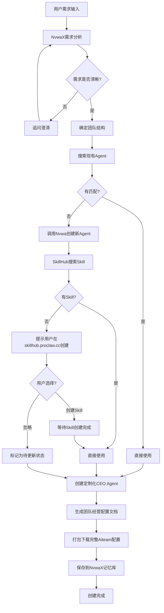

# NvwaX 核心架构设计 - Aiteam创建专家系统

**版本**: v2.0.0  
**创建日期**: 2026-05-19  
**状态**: 设计中  
**作者**: NvwaX Team

---

## 📋 目录

- [1. 架构愿景](#1-架构愿景)
- [2. 核心概念定义](#2-核心概念定义)
- [3. 系统角色与职责](#3-系统角色与职责)
- [4. Aiteam创建流程](#4-aiteam创建流程)
- [5. 技术架构](#5-技术架构)
- [6. 关键创新点](#6-关键创新点)
- [7. 实施路线图](#7-实施路线图)
- [8. 与现有系统集成](#8-与现有系统集成)

---

## 1. 架构愿景

### 1.1 核心定位

**NvwaX = Aiteam创建专家Agent**

NvwaX不是简单的对话引导工具，而是一个专业的AI团队架构师，负责：
- 深度需求分析和澄清
- 智能团队结构设计
- Agent/Skill精准匹配
- 动态CEO Agent生成
- 团队经营配置文档生成
- 自我进化和持续优化

### 1.2 设计原则

1. **职责分离**: NvwaX专注创建，CEO专注管理
2. **动态配置**: 不同团队的CEO拥有不同的Skills
3. **生态整合**: 充分利用SkillHub和现有Agent搜索能力
4. **闭环完整**: 从需求到交付再到文档，形成完整闭环
5. **自我进化**: 通过记忆机制让系统越来越智能

---

## 2. 核心概念定义

### 2.1 NvwaX (Aiteam Creation Expert)

**定义**: 专门负责Aiteam创建的顶层Agent，是整个系统的核心协调者。

**核心能力**:
- 需求分析和澄清（调用DeepSeek等大模型）
- 团队架构设计（基于行业最佳实践）
- Agent/Skill匹配决策（集成搜索引擎）
- 调用Nvwa创建缺失的Agent
- 为每个团队定制CEO Agent
- 生成团队经营配置文档

**记忆系统**:
- 记录每次创建的团队类型和配置
- 学习哪些Agent/Skill组合最有效
- 积累不同行业的最佳实践
- 持续优化推荐算法

### 2.2 CEO Agent (Team Manager)

**定义**: 团队创建后的管理者，负责日常运营和决策。

**特点**:
- **动态生成**: 根据团队类型配置专属Skills
- **定制化Prompt**: 包含团队目标、管理策略、决策规则
- **差异化配置**: 不同团队的CEO需要不同的能力

**示例**:
- 营销团队CEO: 内容策划、数据分析、社交媒体管理等Skills
- 客服团队CEO: 客户沟通、问题解决、情感分析等Skills
- 开发团队CEO: 技术架构、代码审查、项目管理等Skills

### 2.3 Aiteam (AI Team)

**定义**: 由多个Agent组成的协作团队，共同完成特定任务。

**组成**:
- 1个CEO Agent（管理者）
- N个专业Agent（执行者）
- M个Skills（能力支撑）
- 1份团队经营配置文档（运营指南）

### 2.4 团队经营配置文档

**定义**: 每次创建必须生成的完整文档包，确保CEO Agent能够有效管理团队。

**包含内容**:
1. **CEO Agent System Prompt**: 团队目标、管理策略、决策规则
2. **团队协作规范**: 各角色职责、协作流程、沟通机制
3. **运营指南**: KPI指标、优化建议、常见问题处理
4. **技能清单**: 所有Agent和Skills的详细列表
5. **工作流程图**: 团队内部协作流程图

---

## 3. 系统角色与职责

### 3.1 角色对比表

| 角色 | 职责阶段 | 主要任务 | 生命周期 |
|------|---------|---------|---------|
| **NvwaX** | 创建阶段 | 需求分析、团队设计、Agent匹配、CEO生成 | 永久存在，持续进化 |
| **CEO Agent** | 运营阶段 | 团队管理、任务分配、决策制定 | 随团队创建而生成 |
| **专业Agent** | 执行阶段 | 具体任务执行 | 根据需要添加/移除 |
| **用户** | 全程参与 | 提出需求、确认配置、使用团队 | 永久存在 |

### 3.2 职责边界

```
┌─────────────────────────────────────────────┐
│           NvwaX (创建专家)                    │
│  - 理解用户需求                               │
│  - 设计团队结构                               │
│  - 搜索匹配Agent/Skill                       │
│  - 调用Nvwa创建缺失Agent                     │
│  - 生成定制化CEO Agent                       │
│  - 生成团队经营配置文档                       │
│  - 打包交付完整Aiteam                        │
└─────────────────────────────────────────────┘
                    ↓ 创建完成
┌─────────────────────────────────────────────┐
│         CEO Agent (团队管理者)                │
│  - 接收用户任务                              │
│  - 分配给专业Agent                           │
│  - 协调团队协作                              │
│  - 监控团队绩效                              │
│  - 提出优化建议                              │
└─────────────────────────────────────────────┘
                    ↓ 日常运营
┌─────────────────────────────────────────────┐
│       专业Agents (任务执行者)                 │
│  - 执行具体任务                              │
│  - 返回执行结果                              │
│  - 反馈问题和困难                            │
└─────────────────────────────────────────────┘
```

---

## 4. Aiteam创建流程

### 4.1 完整流程图



### 4.2 详细步骤说明

#### Step 1: 需求收集与分析
- NvwaX与用户对话，了解团队目标
- 分析关键信息：行业、职责、产出类型、目标用户
- 识别特殊要求和约束条件

#### Step 2: 团队结构设计
- 基于需求推荐3-5个核心角色
- 定义每个角色的职责和能力要求
- 确定角色间的协作关系

#### Step 3: Agent搜索与匹配
- 调用现有Agent搜索引擎（GitHub + HuggingFace）
- 为每个角色搜索匹配的Agent
- 评分和排序，返回Top 3候选

#### Step 4: Skill匹配与验证
- 为每个Agent匹配所需Skills
- 在SkillHub中搜索对应Skills
- 评估Skill的完整性和质量

#### Step 5: 缺失资源处理
- **Agent缺失**: 调用Nvwa自动创建
- **Skill缺失**: 
  - 选项1: 引导用户到skillhub.proclaw.cc创建
  - 选项2: 标记为"待更新"状态，后续补充

#### Step 6: CEO Agent生成
- 根据团队类型选择CEO模板
- 配置专属Skills（营销/客服/开发等）
- 生成定制化System Prompt
- 包含团队目标、管理策略、决策规则

#### Step 7: 文档生成
- 生成CEO Agent System Prompt
- 生成团队协作规范
- 生成运营指南和KPI指标
- 生成技能清单和工作流程图

#### Step 8: 打包交付
- 整合所有配置到一个包中
- 提供下载链接
- 保存到用户项目库

#### Step 9: 记忆存储
- 记录本次创建的完整配置
- 分析成功因素和改进点
- 更新NvwaX的知识库

---

## 5. 技术架构

### 5.1 系统架构图

```
┌──────────────────────────────────────────────────────┐
│                  前端界面层                            │
│  - 虚拟公司创建对话框                                  │
│  - 进度追踪组件                                        │
│  - 配置预览和下载                                      │
└──────────────────────────────────────────────────────┘
                        ↓ HTTP/WebSocket
┌──────────────────────────────────────────────────────┐
│              NvwaX Service (后端服务)                  │
│                                                       │
│  ┌─────────────────────────────────────────────┐     │
│  │  NvwaX Agent Core                            │     │
│  │  - 需求分析引擎 (DeepSeek API)               │     │
│  │  - 团队设计引擎                              │     │
│  │  - 决策引擎 (Agent/Skill匹配)                │     │
│  └─────────────────────────────────────────────┘     │
│                                                       │
│  ┌─────────────────────────────────────────────┐     │
│  │  Agent Search Integration                    │     │
│  │  - GitHub爬虫                                │     │
│  │  - HuggingFace爬虫                           │     │
│  │  - 本地数据库查询                             │     │
│  └─────────────────────────────────────────────┘     │
│                                                       │
│  ┌─────────────────────────────────────────────┐     │
│  │  SkillHub Integration                        │     │
│  │  - Skill搜索                                 │     │
│  │  - Skill验证                                 │     │
│  │  - Skill依赖分析                             │     │
│  └─────────────────────────────────────────────┘     │
│                                                       │
│  ┌─────────────────────────────────────────────┐     │
│  │  Nvwa Integration                            │     │
│  │  - Agent创建接口                              │     │
│  │  - Skill绑定                                 │     │
│  └─────────────────────────────────────────────┘     │
│                                                       │
│  ┌─────────────────────────────────────────────┐     │
│  │  CEO Agent Generator                         │     │
│  │  - CEO模板库                                 │     │
│  │  - Skill配置器                               │     │
│  │  - Prompt生成器                              │     │
│  └─────────────────────────────────────────────┘     │
│                                                       │
│  ┌─────────────────────────────────────────────┐     │
│  │  Document Generator                          │     │
│  │  - 配置文档生成                              │     │
│  │  - 运营指南生成                              │     │
│  │  - 打包工具                                  │     │
│  └─────────────────────────────────────────────┘     │
│                                                       │
│  ┌─────────────────────────────────────────────┐     │
│  │  Memory System                               │     │
│  │  - 创建历史记录                              │     │
│  │  - 最佳实践库                                │     │
│  │  - 优化建议引擎                              │     │
│  └─────────────────────────────────────────────┘     │
└──────────────────────────────────────────────────────┘
                        ↓ SQL
┌──────────────────────────────────────────────────────┐
│                  数据持久层                            │
│  - PostgreSQL (团队配置、会话历史)                     │
│  - SQLite (本地Agent缓存)                             │
│  - File System (文档包存储)                           │
└──────────────────────────────────────────────────────┘
```

### 5.2 核心服务模块

#### 5.2.1 NvwaX Agent Service
```typescript
interface NvwaXService {
  // 需求分析
  analyzeRequirements(userInput: string): Promise<RequirementAnalysis>;
  
  // 团队设计
  designTeamStructure(requirements: RequirementAnalysis): Promise<TeamDesign>;
  
  // Agent匹配
  matchAgents(teamDesign: TeamDesign): Promise<AgentMatchResult>;
  
  // Skill匹配
  matchSkills(agentList: Agent[]): Promise<SkillMatchResult>;
  
  // CEO生成
  generateCEO(teamType: string, skills: Skill[]): Promise<CEOAgentConfig>;
  
  // 文档生成
  generateDocuments(teamConfig: TeamConfig): Promise<DocumentPackage>;
  
  // 记忆存储
  storeMemory(creationRecord: CreationRecord): Promise<void>;
}
```

#### 5.2.2 CEO Agent Generator
```typescript
interface CEOAgentGenerator {
  // 获取CEO模板
  getTemplate(teamType: string): Promise<CEOTemplate>;
  
  // 配置Skills
  configureSkills(template: CEOTemplate, requiredSkills: Skill[]): Promise<CEOConfig>;
  
  // 生成Prompt
  generatePrompt(config: CEOConfig, teamContext: TeamContext): Promise<string>;
  
  // 创建CEO实例
  createInstance(config: CEOConfig): Promise<CEOAgent>;
}
```

#### 5.2.3 Memory System
```typescript
interface MemorySystem {
  // 存储创建记录
  storeCreation(record: CreationRecord): Promise<void>;
  
  // 查询相似案例
  findSimilarCases(requirements: RequirementAnalysis): Promise<CreationRecord[]>;
  
  // 获取最佳实践
  getBestPractices(teamType: string): Promise<BestPractice[]>;
  
  // 分析成功率
  analyzeSuccessRate(): Promise<SuccessMetrics>;
  
  // 生成优化建议
  generateOptimizationSuggestions(): Promise<OptimizationSuggestion[]>;
}
```

---

## 6. 关键创新点

### 6.1 动态CEO Agent生成

**传统方式**: 所有团队使用相同的CEO Agent  
**创新方式**: 根据团队类型动态配置CEO的Skills和Prompt

**优势**:
- 更专业的团队管理
- 更符合行业特点
- 更高的运营效率

**实现示例**:
```typescript
// 营销团队CEO配置
const marketingCEO = {
  skills: ['content_strategy', 'social_media_analytics', 'campaign_management'],
  prompt: `你是营销团队的CEO，专注于内容策略和社交媒体运营...`
};

// 客服团队CEO配置
const supportCEO = {
  skills: ['customer_communication', 'problem_solving', 'sentiment_analysis'],
  prompt: `你是客服团队的CEO，专注于客户满意度和问题解决...`
};
```

### 6.2 团队经营配置文档

**传统方式**: 仅提供Agent列表  
**创新方式**: 提供完整的运营指南和管理文档

**文档内容**:
1. **CEO System Prompt**: 详细的角色定义和行为准则
2. **团队协作规范**: 清晰的职责分工和协作流程
3. **运营指南**: KPI指标、优化建议、常见问题
4. **技能清单**: 所有能力的详细说明
5. **工作流程图**: 可视化的协作流程

**价值**:
- 降低使用门槛
- 提高团队效率
- 便于后续优化

### 6.3 NvwaX自我进化记忆

**传统方式**: 每次创建都是独立的  
**创新方式**: 持续学习和优化

**记忆内容**:
- 成功的团队配置案例
- 失败的教训和改进点
- 不同行业的最佳实践
- Agent/Skill组合效果评估

**应用场景**:
- 推荐更优的团队结构
- 预测潜在问题
- 自动优化配置

### 6.4 闭环生态整合

**整合点**:
1. **Agent搜索**: 复用现有GitHub/HuggingFace爬虫
2. **SkillHub**: 深度集成Skill搜索和创建
3. **Nvwa**: 自动创建缺失的Agent
4. **用户反馈**: 持续优化推荐算法

**优势**:
- 避免重复造轮子
- 充分利用现有资源
- 形成完整生态系统

---

## 7. 实施路线图

### Phase 1: 核心架构重构 (2-3周)

**目标**: 建立NvwaX基础框架，替代当前CEO Agent的创建引导功能

**任务**:
1. ✅ 创建NvwaX Agent Service
   - 需求分析引擎（集成DeepSeek）
   - 团队设计引擎
   - 决策引擎

2. ✅ 重构虚拟公司创建流程
   - 修改前端对话框逻辑
   - 更新后端API路由
   - 调整会话状态管理

3. ✅ 集成现有Agent搜索引擎
   - 复用GitHub/HuggingFace爬虫
   - 实现Agent评分和排序
   - 返回Top 3候选

4. ✅ 实现基本的Skill匹配逻辑
   - 调用SkillHub API
   - 验证Skill完整性
   - 处理缺失情况

**交付物**:
- NvwaX Service核心代码
- 更新的虚拟公司创建API
- 集成的Agent搜索功能
- 基础的Skill匹配功能

### Phase 2: CEO Agent动态生成 (2周)

**目标**: 实现基于团队类型的CEO Agent定制化生成

**任务**:
1. ✅ 建立CEO Agent模板库
   - 营销团队模板
   - 客服团队模板
   - 开发团队模板
   - 数据分析团队模板

2. ✅ 实现基于团队类型的Skill配置
   - 定义每种团队类型的必需Skills
   - 实现Skill自动匹配
   - 支持自定义Skill添加

3. ✅ 生成团队经营配置文档
   - CEO System Prompt生成器
   - 团队协作规范生成器
   - 运营指南生成器
   - 打包工具

**交付物**:
- CEO模板库（至少4种类型）
- 动态Skill配置器
- 文档生成器
- 完整的配置包下载功能

### Phase 3: Nvwa集成和SkillHub深度整合 (2-3周)

**目标**: 实现缺失资源的自动处理和SkillHub深度集成

**任务**:
1. ✅ 实现缺失Agent的自动创建
   - 调用Nvwa API
   - 传递需求参数
   - 接收创建的Agent

2. ✅ SkillHub搜索和创建引导
   - 检测缺失Skills
   - 提供创建链接（skillhub.proclaw.cc）
   - 监听Skill创建完成

3. ✅ "待更新"状态管理
   - 标记不完整配置
   - 提醒用户补充
   - 支持后续更新

**交付物**:
- Nvwa集成接口
- SkillHub创建引导UI
- 待更新状态管理系统
- 完整的资源处理流程

### Phase 4: 自我进化系统 (3-4周)

**目标**: 建立NvwaX记忆数据库，实现持续优化

**任务**:
1. ✅ 建立NvwaX记忆数据库
   - 设计数据模型
   - 实现存储接口
   - 建立索引

2. ✅ 实现创建经验积累
   - 记录每次创建详情
   - 收集用户反馈
   - 分析成功因素

3. ✅ 优化推荐算法
   - 基于历史数据改进推荐
   - 实现相似度匹配
   - 提供个性化建议

4. ✅ 建立最佳实践库
   - 整理成功案例
   - 提炼通用模式
   - 生成优化建议

**交付物**:
- 记忆数据库
- 经验积累系统
- 优化推荐引擎
- 最佳实践库

### Phase 5: 高级功能和优化 (持续)

**目标**: 增强系统能力和用户体验

**任务**:
1. 团队健康度评估
2. 团队迭代升级
3. Skill依赖图谱
4. 成本效益分析
5. 多语言支持
6. 性能优化

---

## 8. 与现有系统集成

### 8.1 现有系统清单

| 系统 | 用途 | 集成方式 |
|------|------|---------|
| **Agent搜索引擎** | GitHub/HuggingFace爬虫 | API调用，复用爬虫服务 |
| **SkillHub** | Skill搜索和管理 | API集成，深度耦合 |
| **Nvwa** | Agent创建 | API调用，触发创建流程 |
| **虚拟公司会话系统** | 用户对话管理 | 扩展会话状态，增加NvwaX阶段 |
| **PostgreSQL数据库** | 数据存储 | 新增NvwaX记忆表 |
| **SSE进度追踪** | 实时进度推送 | 扩展进度步骤，增加NvwaX阶段 |

### 8.2 集成策略

#### 8.2.1 Agent搜索引擎集成
```typescript
// 复用现有的agentCompatibilityService
import { agentCompatibilityService } from './agent-compatibility.service';

// 在NvwaX中调用
const scoredAgents = await agentCompatibilityService.searchAndScoreAgents(
  roleRequirement,
  3 // Top 3
);
```

#### 8.2.2 SkillHub集成
```typescript
// 调用SkillHub API
const skillSearch = await fetch(`${SKILLHUB_API_URL}/skills/search`, {
  method: 'POST',
  body: JSON.stringify({ query: skillName })
});

// 处理缺失Skill
if (!skillFound) {
  return {
    status: 'missing',
    action: 'create',
    url: `https://skillhub.proclaw.cc/create?name=${skillName}`
  };
}
```

#### 8.2.3 Nvwa集成
```typescript
// 调用Nvwa创建Agent
const newAgent = await nvwaService.createAgent({
  name: agentName,
  description: agentDescription,
  requiredSkills: skills
});
```

#### 8.2.4 数据库扩展
```sql
-- NvwaX记忆表
CREATE TABLE nvwax_memories (
  id TEXT PRIMARY KEY,
  team_type TEXT NOT NULL,
  requirements JSONB,
  team_config JSONB,
  success_score FLOAT,
  user_feedback TEXT,
  created_at TIMESTAMP DEFAULT NOW()
);

-- CEO模板表
CREATE TABLE ceo_templates (
  id TEXT PRIMARY KEY,
  team_type TEXT NOT NULL,
  template_name TEXT,
  default_skills JSONB,
  system_prompt_template TEXT,
  created_at TIMESTAMP DEFAULT NOW()
);
```

### 8.3 兼容性保证

1. **向后兼容**: 保留现有的虚拟公司创建API
2. **渐进式迁移**: 先实现核心功能，再逐步增强
3. **降级策略**: 如果NvwaX失败，回退到简单模式
4. **数据迁移**: 现有团队配置可导入到新系统

---

## 9. 风险评估与应对

### 9.1 技术风险

| 风险 | 影响 | 概率 | 应对措施 |
|------|------|------|---------|
| DeepSeek API不稳定 | 高 | 中 | 实现降级策略，使用模拟响应 |
| SkillHub API变更 | 中 | 低 | 建立API适配层，定期测试 |
| 数据库性能瓶颈 | 中 | 中 | 优化查询，添加索引，考虑缓存 |
| Agent搜索超时 | 低 | 中 | 设置超时限制，异步处理 |

### 9.2 业务风险

| 风险 | 影响 | 概率 | 应对措施 |
|------|------|------|---------|
| 用户需求理解偏差 | 高 | 中 | 增加澄清环节，提供示例 |
| 推荐质量不高 | 高 | 中 | 持续优化算法，收集反馈 |
| 用户学习成本高 | 中 | 低 | 提供教程和引导 |
| 创建时间过长 | 中 | 中 | 优化流程，并行处理 |

---

## 10. 成功指标

### 10.1 技术指标

- **创建成功率**: > 90%
- **平均创建时间**: < 5分钟
- **Agent匹配准确率**: > 80%
- **Skill匹配覆盖率**: > 85%
- **系统可用性**: > 99%

### 10.2 业务指标

- **用户满意度**: > 4.5/5
- **团队使用率**: > 70%的创建团队被实际使用
- **复购率**: > 30%的用户创建第二个团队
- **NPS评分**: > 50

### 10.3 进化指标

- **记忆库规模**: 每月增长 > 100条记录
- **推荐优化率**: 每月提升 > 5%
- **最佳实践覆盖**: 覆盖 > 10种团队类型

---

## 11. 附录

### 11.1 术语表

| 术语 | 定义 |
|------|------|
| **NvwaX** | Aiteam创建专家Agent，负责整个创建流程 |
| **CEO Agent** | 团队管理者，负责日常运营 |
| **Aiteam** | 由多个Agent组成的协作团队 |
| **Skill** | Agent的能力单元 |
| **团队经营配置文档** | 包含CEO Prompt、协作规范、运营指南的完整文档包 |

### 11.2 参考资料

- [Nvwa智能体工厂设计文档](../docs-archive/design-docs/NVWA-AGENT-FACTORY-PLAN.md)
- [SkillHub API文档](https://skillhub.proclaw.cc/api/docs)
- [Agent搜索引擎架构](../packages/nvwax-server/src/services/agent-search.service.ts)

### 11.3 更新记录

| 日期 | 版本 | 更新内容 | 作者 |
|------|------|---------|------|
| 2026-05-19 | v2.0.0 | 初始版本，完整架构设计 | NvwaX Team |

---

<div align="center">

**NvwaX - Aiteam创建专家系统**

*让AI团队创建更智能、更高效、更专业* 🚀

</div>
