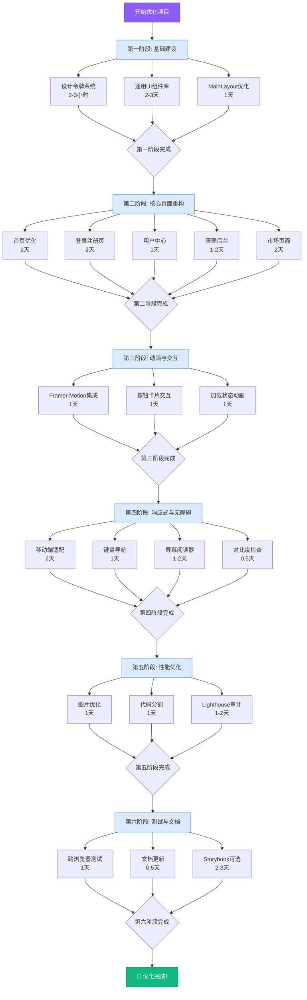

# NvwaX UI/UX 优化路线图

## 🗺️ 可视化实施路线



---

## 📅 详细时间安排

### 第 1 周：基础建设（3-4 天）

```
周一 (Day 1)
├─ 上午: 创建设计令牌系统
│  ├─ CSS 变量定义
│  └─ Tailwind 配置扩展
└─ 下午: 开始 UI 组件库
   ├─ Button 组件
   └─ Card 组件

周二 (Day 2)
├─ 上午: 继续 UI 组件库
│  ├─ Input 组件
│  ├─ Select 组件
│  └─ Badge 组件
└─ 下午: 继续 UI 组件库
   ├─ Avatar 组件
   ├─ Loading 组件
   └─ EmptyState 组件

周三 (Day 3)
├─ 上午: 完成 UI 组件库
│  └─ Toast 组件
└─ 下午: MainLayout 优化
   ├─ 创建 Container 组件
   ├─ 重构 MainLayout
   └─ 优化 Header/Footer

周四 (Day 4) - 缓冲日
├─ 组件测试和修复
├─ 代码审查
└─ 文档编写
```

**本周交付物**:
- ✅ 完整的设计令牌系统
- ✅ 8+ 通用 UI 组件
- ✅ 优化后的 MainLayout
- ✅ 组件使用文档

---

### 第 2-3 周：核心页面重构（8-9 天）

```
第 2 周

周一 (Day 5) - 首页优化
├─ 上午: Hero 区域重构
│  ├─ 渐变背景
│  ├─ 装饰元素
│  └─ 搜索框优化
└─ 下午: Agent 卡片组件
   ├─ 创建 AgentCard
   └─ 优化列表布局

周二 (Day 6) - 首页完成 + 登录页开始
├─ 上午: 完成首页
│  ├─ 快速筛选器
│  └─ 响应式调整
└─ 下午: 登录页分屏布局
   ├─ 左侧品牌展示
   └─ 右侧表单框架

周三 (Day 7) - 登录/注册页
├─ 上午: 完成登录页
│  ├─ 社交登录
│  └─ 表单验证
└─ 下午: 注册页
   ├─ 复用登录页布局
   └─ 添加额外字段

周四 (Day 8) - 用户中心
├─ 上午: 布局调整
│  ├─ 比例从 4:8 改为 3:9
│  └─ 导航菜单优化
└─ 下午: 功能增强
   ├─ 添加面包屑
   └─ 活跃指示器

周五 (Day 9) - 管理后台
├─ 上午: 侧边栏优化
│  ├─ 宽度增加
│  └─ 折叠功能
└─ 下午: 头部增强
   ├─ 用户信息
   └─ 快捷操作

第 3 周

周一 (Day 10) - 管理后台完成
├─ 上午: 完成侧边栏
└─ 下午: 测试所有管理页面

周二 (Day 11) - 市场页面开始
├─ 上午: 分类侧边栏
│  └─ 左侧导航
└─ 下午: 筛选工具栏
   ├─ 排序下拉
   └─ 视图切换

周三 (Day 12) - 市场页面完成
├─ 上午: 完成筛选功能
└─ 下午: 响应式调整

周四 (Day 13) - 缓冲日
├─ 所有页面测试
├─ Bug 修复
└─ 性能优化

周五 (Day 14) - 评审日
├─ 上午: 内部演示
└─ 下午: 收集反馈并调整
```

**本周交付物**:
- ✅ 优化的首页
- ✅ 现代化的登录/注册页
- ✅ 改进的用户中心
- ✅ 增强的管理后台
- ✅ 功能完善的市场页面

---

### 第 4 周：动画与交互（3 天）

```
周一 (Day 15) - Framer Motion 集成
├─ 上午: 安装和配置
│  └─ pnpm add framer-motion
└─ 下午: 页面过渡
   ├─ 创建 PageTransition
   └─ 集成到 layout

周二 (Day 16) - 交互优化
├─ 上午: 按钮动画
│  ├─ 悬停缩放
│  └─ 点击反馈
└─ 下午: 卡片动画
   ├─ 悬停提升
   └─ 阴影变化

周三 (Day 17) - 加载状态
├─ 上午: 加载组件
│  ├─ LoadingSpinner
│  └─ Skeleton
└─ 下午: 集成到异步操作
   ├─ API 调用
   └─ 页面加载
```

**本周交付物**:
- ✅ Framer Motion 集成
- ✅ 流畅的页面过渡
- ✅ 精致的交互动画
- ✅ 统一的加载状态

---

### 第 5 周：响应式与无障碍（4-5 天）

```
周一 (Day 18) - 移动端适配 (1)
├─ 上午: 汉堡菜单
│  └─ 抽屉式导航
└─ 下午: 首页移动端
   ├─ 搜索框优化
   └─ 卡片布局

周二 (Day 19) - 移动端适配 (2)
├─ 上午: 用户中心移动端
│  └─ 导航优化
└─ 下午: 管理后台移动端
   ├─ 侧边栏处理
   └─ 表格转卡片

周三 (Day 20) - 键盘导航
├─ 上午: Tab 顺序优化
│  └─ 焦点管理
└─ 下午: 快捷键支持
   ├─ ESC 关闭弹窗
   └─ Enter 激活按钮

周四 (Day 21) - 屏幕阅读器
├─ 上午: ARIA 标签
│  └─ 语义化 HTML
└─ 下午: 测试
   ├─ NVDA 测试
   └─ VoiceOver 测试

周五 (Day 22) - 对比度检查
├─ 上午: 自动化检查
│  └─ axe DevTools
└─ 下午: 手动修复
   └─ 调整颜色
```

**本周交付物**:
- ✅ 完美的移动端体验
- ✅ 完整的键盘导航
- ✅ 屏幕阅读器兼容
- ✅ WCAG AA 合规

---

### 第 6 周：性能优化与测试（3-4 天）

```
周一 (Day 23) - 图片优化
├─ 上午: Next.js Image
│  └─ 替换所有 img
└─ 下午: 配置优化
   ├─ 域名白名单
   └─ 格式转换

周二 (Day 24) - 代码分割
├─ 上午: 动态导入
│  └─ 大型组件
└─ 下午: 路由级分割
   └─ 管理页面

周三 (Day 25) - Lighthouse 审计
├─ 上午: 关键页面审计
│  ├─ 首页
│  ├─ 登录页
│  └─ 用户中心
└─ 下午: 优化和问题修复

周四 (Day 26) - 跨浏览器测试
├─ 上午: 桌面端测试
│  ├─ Chrome
│  ├─ Firefox
│  ├─ Safari
│  └─ Edge
└─ 下午: 移动端测试
   ├─ iOS Safari
   └─ Android Chrome

周五 (Day 27) - 文档和收尾
├─ 上午: 更新文档
│  ├─ 设计系统
│  └─ 组件文档
└─ 下午: 最终检查
   ├─ 代码审查
   └─ 发布准备
```

**本周交付物**:
- ✅ 优化的图片加载
- ✅ 高效的代码分割
- ✅ Lighthouse 90+ 评分
- ✅ 跨浏览器兼容
- ✅ 完善的文档

---

## 📊 里程碑检查点

### Milestone 1: 基础建设完成（第 1 周末）
- [ ] 设计令牌系统可用
- [ ] 8+ UI 组件完成
- [ ] MainLayout 重构完成
- [ ] 团队培训完成

**验收标准**:
- 所有新组件在 Storybook 中可预览
- MainLayout 无负 margin hack
- 团队成员理解新的设计规范

---

### Milestone 2: 核心页面完成（第 3 周末）
- [ ] 首页优化完成
- [ ] 登录/注册页重构完成
- [ ] 用户中心优化完成
- [ ] 管理后台优化完成
- [ ] 市场页面改进完成

**验收标准**:
- 所有页面对比设计稿一致
- 响应式布局正确
- 功能测试通过

---

### Milestone 3: 交互动画完成（第 4 周末）
- [ ] Framer Motion 集成
- [ ] 页面过渡流畅
- [ ] 按钮和卡片动画完成
- [ ] 加载状态统一

**验收标准**:
- 动画帧率稳定 60fps
- 无性能问题
- 用户体验流畅

---

### Milestone 4: 无障碍完成（第 5 周末）
- [ ] 移动端适配完成
- [ ] 键盘导航完善
- [ ] 屏幕阅读器测试通过
- [ ] 颜色对比度达标

**验收标准**:
- 移动端可用性评分 > 95
- 无障碍评分 > 90
- WCAG AA 合规

---

### Milestone 5: 项目完成（第 6 周末）
- [ ] 性能优化完成
- [ ] Lighthouse 评分达标
- [ ] 跨浏览器测试通过
- [ ] 文档更新完成

**验收标准**:
- Lighthouse 性能 > 90
- 所有浏览器测试通过
- 文档完整准确
- 项目可以发布

---

## 🎯 关键成功因素

### 技术层面
1. **统一的设计系统** - 确保一致性
2. **可复用的组件库** - 提高开发效率
3. **流畅的动画效果** - 提升用户体验
4. **优秀的性能表现** - 减少跳出率
5. **完善的无障碍支持** - 扩大用户群体

### 团队层面
1. **清晰的分工** - 避免重复工作
2. **有效的沟通** - 及时解决问题
3. **定期的评审** - 确保方向正确
4. **严格的代码审查** - 保证质量
5. **充分的测试** - 发现潜在问题

### 管理层面
1. **明确的目标** - 知道要做什么
2. **合理的计划** - 知道何时完成
3. **充足的资源** - 有足够的人力和时间
4. **灵活的调整** - 应对突发情况
5. **持续的跟进** - 确保按计划进行

---

## ⚠️ 风险与应对

### 风险 1: 时间不足
**影响**: 无法按时完成所有优化  
**概率**: 中等  
**应对**:
- 优先完成高优先级任务
- 适当延长项目周期
- 增加开发人员

### 风险 2: 技术难点
**影响**: 某些功能实现困难  
**概率**: 低  
**应对**:
- 提前进行技术预研
- 寻求社区帮助
- 考虑替代方案

### 风险 3: 需求变更
**影响**: 已完成的 work 需要返工  
**概率**: 中等  
**应对**:
- 与设计团队充分沟通
- 定期确认需求
- 保持代码灵活性

### 风险 4: 性能问题
**影响**: 动画导致卡顿  
**概率**: 低  
**应对**:
- 持续监控性能指标
- 优化动画实现
- 提供禁用选项

---

## 📈 进度跟踪

### 每周报告模板

```markdown
## 第 X 周进度报告

### 本周完成
- [任务 1] ✅
- [任务 2] ✅
- [任务 3] ⏳ 50%

### 遇到的问题
1. 问题描述
   - 原因分析
   - 解决方案

### 下周计划
- [任务 4]
- [任务 5]
- [任务 6]

### 需要的支持
- [资源/协助需求]

### 关键指标
- Lighthouse 评分: XX
- 页面加载时间: X.Xs
- Bug 数量: X
```

---

## 🎉 庆祝时刻

在每个里程碑完成时，团队应该：
1. **演示成果** - 向全体团队展示
2. **收集反馈** - 听取意见和建议
3. **庆祝成就** - 小聚或团建活动
4. **总结经验** - 记录好的做法
5. **规划下一步** - 明确后续工作

---

**路线图版本**: 1.0.0  
**最后更新**: 2026-05-19  
**预计完成**: 2026-06-30
